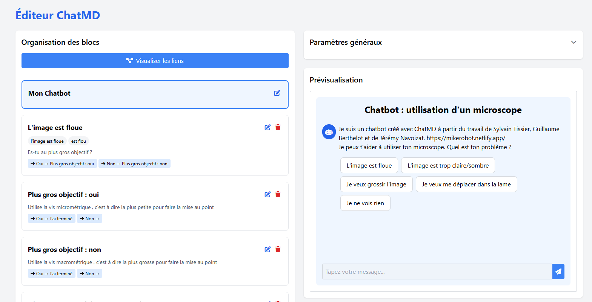

# ChatMD Editor


ChatMD Editor est un éditeur visuel pour créer et gérer des chatbots basés sur Markdown. Il permet de créer des conversations interactives avec des choix multiples, des déclencheurs et des réponses personnalisées.

## 🌟 Fonctionnalités

- **Édition par blocs** : Interface intuitive pour créer et organiser les blocs de conversation
- **Prévisualisation en temps réel** : Visualisez votre chatbot pendant que vous le créez
- **Gestion des liens** : Créez facilement des liens entre les différents blocs de conversation
- **Personnalisation avancée** : Modifiez l'apparence et le comportement de votre chatbot
- **Exportation Markdown** : Exportez votre chatbot au format Markdown standard
- **Génération par IA** : Créez automatiquement des chatbots à partir de documents existants
- **Support LLM local et en ligne** : Utilisez Jan.ai en local ou l'API Mistral en ligne
- **Accessibilité** : Interface conçue pour être accessible à tous

## 📋 Prérequis

- Python 3.7+
- Flask
- Navigateur web moderne

## 🚀 Installation

1. Clonez ce dépôt :
   ```bash
   git clone https://github.com/votre-utilisateur/chatmd-editor.git
   cd chatmd-editor
   ```

2. Installez les dépendances :
   ```bash
   pip install -r requirements.txt
   ```

3. Lancez l'application :
   ```bash
   python app.py
   ```

4. Ouvrez votre navigateur à l'adresse : [http://127.0.0.1:5000](http://127.0.0.1:5000)

## 🚀 Déploiement en Production

Pour déployer l'application en environnement de production, utilisez les scripts de lancement fournis :

### Sous Windows

```
launch_prod.bat
```

### Sous Linux/macOS

```bash
chmod +x launch_prod.sh
./launch_prod.sh
```

Le serveur sera accessible à l'adresse : [http://0.0.0.0:8000](http://0.0.0.0:8000)



Pour plus d'informations sur le déploiement en production, consultez le fichier [PRODUCTION.md](PRODUCTION.md).

## 🔧 Utilisation

### Organisation des blocs

L'éditeur est organisé en blocs de conversation :
- **Bloc d'accueil** : Le point d'entrée de votre chatbot
- **Blocs de réponse** : Les différentes réponses que peut donner votre chatbot

Chaque bloc peut contenir :
- Un titre
- Des déclencheurs (pour les blocs de réponse)
- Du contenu en Markdown
- Des choix qui mènent à d'autres blocs

### Paramètres généraux

Personnalisez l'apparence et le comportement de votre chatbot avec les paramètres suivants :

| Paramètre | Description |
|-----------|-------------|
| Gestion des gros mots | Active/désactive le filtrage des gros mots |
| Style CSS | Permet d'ajouter des styles CSS personnalisés |
| Avatar | URL de l'image à utiliser comme avatar du chatbot |
| Avatar en cercle | Affiche l'avatar dans un cercle |
| Favicon | URL de l'icône à utiliser dans les onglets du navigateur |
| Pied de page | Texte à afficher dans le pied de page (ou `false` pour le désactiver) |
| Thème | Thème CSS à utiliser (ex: `bubbles`) |
| Effet machine à écrire | Active/désactive l'effet de texte qui s'écrit progressivement |
| Champ d'entrée clavier | Active/désactive le champ de saisie pour l'utilisateur |

### Fonctionnalités avancées

- **Visualisation des liens** : Affichez un diagramme des liens entre les blocs
- **Admonitions** : Ajoutez des notes, avertissements et autres blocs d'information
- **Drag & Drop** : Réorganisez vos blocs par glisser-déposer
- **Édition Markdown** : Accédez directement au code Markdown sous-jacent
- **Génération par IA** : Créez automatiquement des chatbots à partir de documents existants

### Configuration des LLM (Modèles de Langage)

L'application prend en charge deux modes de fonctionnement pour la génération par IA :

#### Mode Local (Jan.ai)

1. Téléchargez et installez [Jan.ai](https://jan.ai/) (disponible pour Windows, Mac et Linux)
2. Lancez Jan.ai et installez le modèle **mistral:7b** depuis la bibliothèque de modèles
3. Activez l'API locale dans les paramètres de Jan.ai (Settings → API → Enable API Server)
4. Assurez-vous que l'API est accessible à l'adresse `http://localhost:1337/v1/chat/completions`
5. Sélectionnez le modèle **mistral:7b** comme modèle actif dans Jan.ai

#### Mode En Ligne (API Mistral)

1. Créez un fichier `.env` à la racine du projet avec les informations suivantes :
   ```
   # Configuration de l'API Mistral
   MISTRAL_API_KEY=votre_clé_api_mistral
   MISTRAL_API_URL=https://api.mistral.ai/v1/chat/completions
   MISTRAL_MODEL=codestral-latest
   
   # Configuration du LLM local
   LOCAL_API_URL=http://localhost:1337/v1/chat/completions
   LOCAL_MODEL=mistral:7b
   ```
2. Remplacez `votre_clé_api_mistral` par votre clé API Mistral

#### Basculer entre les modes

Dans l'interface, vous pouvez facilement basculer entre le mode local et le mode en ligne en utilisant le switch présent dans :
- La page principale (Éditeur ChatMD) sous "Configuration LLM"
- La page de génération par IA (accessible via le bouton "Génération par IA")

Le système détecte automatiquement la disponibilité du LLM local et bascule vers le mode en ligne si nécessaire.

## 📝 Format Markdown

Le format ChatMD est basé sur Markdown avec quelques extensions :

```markdown
---
gestionGrosMots: true
style: "a{color:red}"
avatar: "https://example.com/avatar.png"
avatarCercle: true
---

# Titre du Chatbot
Message initial du chatbot
1. [Premier choix](Réponse 1)
2. [Deuxième choix](Réponse 2)

## Réponse 1
- déclencheur 1
- déclencheur 2
Contenu de la réponse 1
1. [Option 1](Option 1)
2. [Option 2](Option 2)

## Réponse 2
- déclencheur
Contenu de la réponse 2
```

## 🌐 Publication et Utilisation du Chatbot

Une fois votre chatbot créé et exporté au format Markdown, vous pouvez le publier et le rendre accessible aux utilisateurs en suivant ces étapes :

1. **Déposez votre fichier Markdown** sur [CodiMD](https://codimd.apps.education.fr/)
   - Créez un compte ou connectez-vous
   - Créez un nouveau document et importez votre fichier Markdown
   - Publiez le document pour obtenir une URL publique (par exemple: `https://codimd.apps.education.fr/s/9TeLcJlKz`)

2. **Accédez à votre chatbot** via l'URL de ChatMD suivie de l'URL de votre document CodiMD :
   - Format: `https://chatmd.forge.apps.education.fr/#URL_DE_VOTRE_DOCUMENT`
   - Exemple: `https://chatmd.forge.apps.education.fr/#https://codimd.apps.education.fr/s/9TeLcJlKz`

3. **Partagez cette URL** avec vos utilisateurs pour qu'ils puissent interagir avec votre chatbot

Cette méthode vous permet de mettre à jour facilement votre chatbot en modifiant simplement le document sur CodiMD, sans avoir à redéployer quoi que ce soit.

## 🤝 Contribution

Les contributions sont les bienvenues ! N'hésitez pas à ouvrir une issue ou à soumettre une pull request.

## 📄 Licence

Ce projet est sous licence MIT. Voir le fichier `LICENSE` pour plus de détails.

## 🙏 Remerciements

- [Showdown.js](https://github.com/showdownjs/showdown) pour la conversion Markdown
- [Tailwind CSS](https://tailwindcss.com/) pour le style
- [Font Awesome](https://fontawesome.com/) pour les icônes
- [JS-YAML](https://github.com/nodeca/js-yaml) pour le parsing YAML
- [Jan.ai](https://jan.ai/) pour le LLM local
- [Mistral AI](https://mistral.ai/) pour l'API de génération de texte
- [python-dotenv](https://github.com/theskumar/python-dotenv) pour la gestion des variables d'environnement
